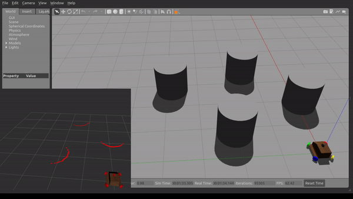

# Angular Field Obstacle Avoidance

This repository contains the implementation of an angular field based obstacle avoidance controller for an omni-directional ground robot  

The robot used 2D-LiDAR data to modify velocity commands and avoid obstacles while maintaining the best possible global direction towards the given goal point.
The scripts have been tested on ROS Noetic with the [omnibase](https://github.com/ERC-BPGC/omnibase) simulator in Gazebo with Ubuntu 20.04.  
Full documentation on the way ^ ^
  
<u>Reference for the idea:</u>
 
Daniel Schleich and Sven Behnke, *Predictive Angular Potential Field-based Obstacle Avoidance for Dynamic UAV Flights* (IEEE/RSJ IROS 2022)
